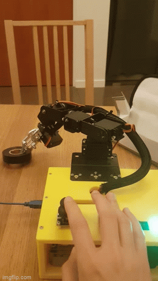

# robo_arm
This is a robot arm project that has two capabilities. The first is an arduino based arm that can be controlled via onboard joysticks and displays output to an OLED screen as it moves in x, y, z space with an inverse kinematic model. The second is a ROS Powered version that uses rosserial to communicate with the master node, and allows publishing of messages on a topic to command the arm in x, y, z coordinates.
  

[Here](https://www.youtube.com/watch?v=9vvvBXWQKJA) is a demo of the arduino based version of the arm, and [here](https://www.youtube.com/watch?v=Fptv3H4Jj54) is a demo of the ros based version of the arm.  

# Table of Contents
[Project Phases](#Project-Phases)  
[Inverse Kinematics](#Inverse-Kinematics)  
[Setting Up your Arm (ROS)](#Setting-It-Up-ROS)  
[Setting Up your Arm (Arduino)](#Setting-It-Up-Arduino)   

# Project Phases
1. Repairing Arm
2. Testing Electronics
3. Initial Arduino Approach
4. 3d Modelling/Printing Base
5. Assembly
6. Simple Arduino Software
7. Complex Arduino Software with IK Model
8. Complex ROS Software with IK Model

Battery Fiasco

# Inverse Kinematics

# Setting It Up ROS

First, make a catkin workspace for the robo arm.
```
mkdir -p ~/robo_arm_catkin/src
cd ~/robo_arm_catkin/src
```

Then, clone the repo into the src folder of the catkin ws you created
```
git clone https://github.com/MZandtheRaspberryPi/robo_arm.git
```

Now you can make the catkin ws and then source it and run commands.
```
cd ~/robo_arm_catkin
catkin_make
source ~/robo_arm_catkin/devel/setup.bash
```

To generate the custom arduino messages, find the location of your arduino libraries folder and remove the ros_lib, and regenerate it. Make sure you've sourced the robo_arm workspace.
```
rm -rf /home/mz/Arduino/libraries/ros_lib
rosrun rosserial_arduino make_libraries.py ~/Arduino/libraries
```

Running the launch file. Note that my launch file that launches the serial node to communicate with the arm is set to ttyS0 as i'm using a VM and passing the com port to the VM. If you have your robo arm connected to a different serial port you'll need to edit the launch file and change the parameter for the serial port accordingly.
```
roslaunch robo_arm robo_arm.launch 
```

Early on, realized that having 1 publisher and 1 subscriber in an Arduino Uno was pushing memory limitations. Hence, trimmed down message with just changes in x, y, z, and gripper, and time to reach there.

message example:
```
rostopic pub /robo_arm_teleop/arm_movement robo_arm/arm_control -1 '{x: 0, y: 180, z: 158, grip: 1700, duration: 1000}'
```

# Setting It Up Arduino
