# robo_arm
This is a robot arm project that has two capabilities. The first is an arduino based arm that can be controlled via onboard joysticks and displays output to an OLED screen as it moves in x, y, z space with an inverse kinematic model. The second is a ROS Powered version that uses rosserial to communicate with the master node, and allows publishing of messages on a topic to command the arm in x, y, z coordinates.
  

[Here](https://www.youtube.com/watch?v=9vvvBXWQKJA) is a demo of the arduino based version of the arm, and [here](https://www.youtube.com/watch?v=Fptv3H4Jj54) is a demo of the ros based version of the arm.  

The Arduino code for the ROS implementation is in the arduino_ros_arm folder, whereas the Arduino code for the standalone version is in the robo_arm_arduino_inverse_kinematics folder.

# Using the ROS Implementation
Follow the Steps in the Setting Up your Arm (ROS) section, and then launch the node:   
```
roslaunch robo_arm robo_arm.launch 
```  

And from here you can publish messages to control the arm:  
```
rostopic pub /robo_arm_teleop/arm_movement robo_arm/arm_control -1 '{x: 0, y: 180, z: 158, grip: 1700, duration: 1000}'
```  

# Table of Contents
[Project Phases](#Project-Phases)  
[Inverse Kinematics](#Inverse-Kinematics)  
[Setting Up your Arm (ROS)](#Setting-It-Up-ROS)  
[Setting Up your Arm (Arduino)](#Setting-It-Up-Arduino)   

# Project Phases
1. Repairing Arm
2. Testing Electronics
3. Initial Arduino Approach
4. 3d Modelling
5. Printing the Base
6. Assembly
7. Complex Arduino Software with IK Model
8. Complex ROS Software with IK Model

## Repairing the Arm
I actually got the raw parts for this arm from a friend, but it wasn't in working order when I got it, and didn't have any software.  It was too top heavy and the bottom servos couldn't support the weight well, and a lot of the joints weren't well secured. Also, the bottom piece of the arm had screws going into the plastic of the servo, so it couldn't rotate the arm left to right.    
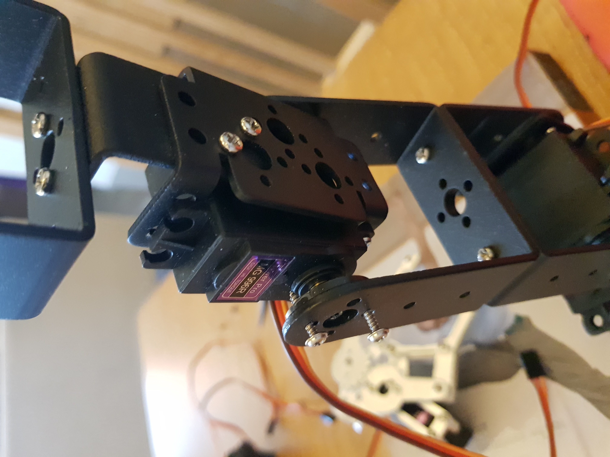   

I ended up replacing the servo horns with metal ones, that had screw holes that matched the screw holes of the metal body (M3). This helped me tighten the joints more securely, and not use long screws that could prevent rotation. I also removed a joint from the arm, bringing it from 6 to 5 joints to help it be not so top heavy.  

## Testing Electronics
From here, I rebuilt the arm and started testing the electronics system I wanted to put in place--powering the servos from Lipo Batteries through a 5v converter that can do up to 10 Amps.  
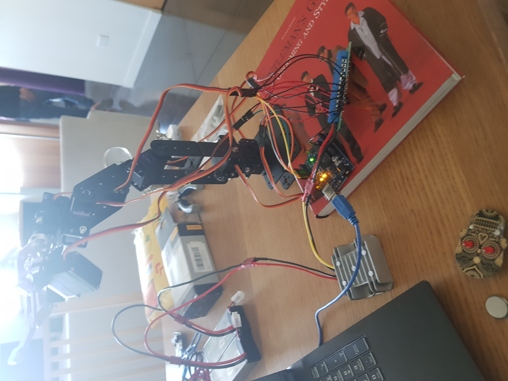  

You can see here all the guts of the system with the emergency off switch, relay, OLED display, and more:  
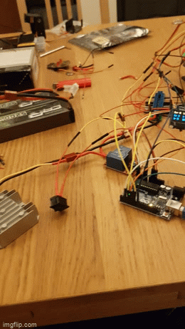  

## Initial Arduino Approach
This would end up being simplistic code that moved each servo in angle space, moving them all in small steps to simulate coordinated motion. The Arduino code for this is in the robo_arm_arduino folder. It was an early prototype that I would build on in later software iterations, but it did serve as a proof of concept that coordinated movement was possible with the hardware setup. That said, if you wanted to move the gripper forward, you had to blend the angles yourself. Obviously this isn't ideal.  
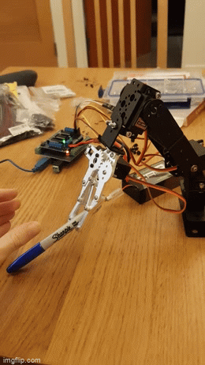  

## 3d Modelling 
From here I wanted to tidy up the electronics, so I modelled a suitable base station. I first drew some sketches, picturing a base with electronics and the robo arm sitting on top.  
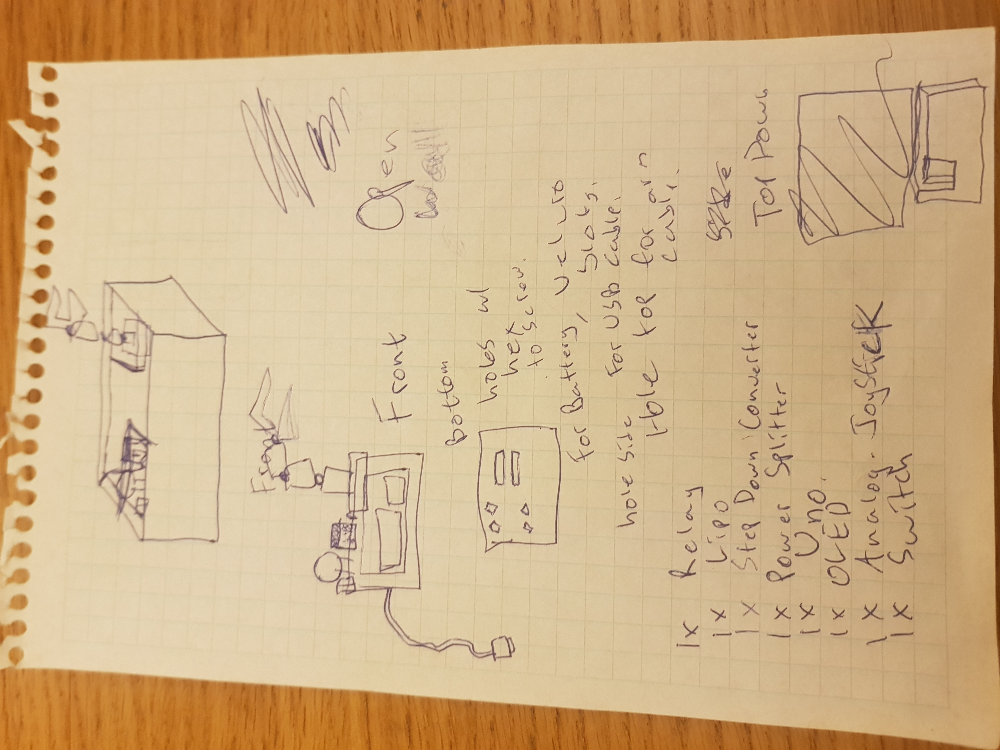  

And from here I modelled it in Fusion 360.
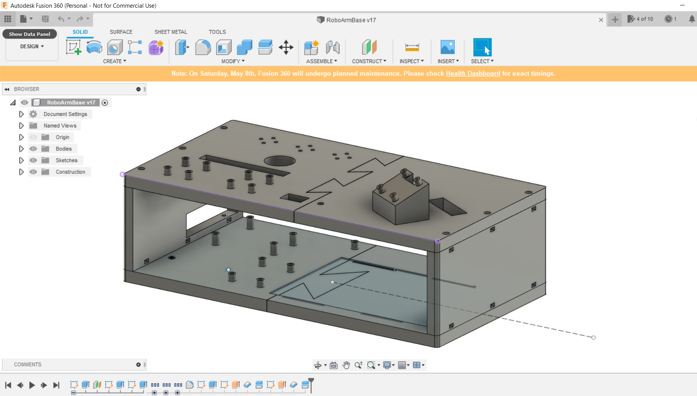  

Given this base was going to be quite big, 300mm by 155mm and 90mm tall, if I messed up any of the mounts or parts, it would take a lot to reprint it. So, I did a lot of prototyping for every single mounting point, as well as the mechanism that the sides of the base join to each other.  
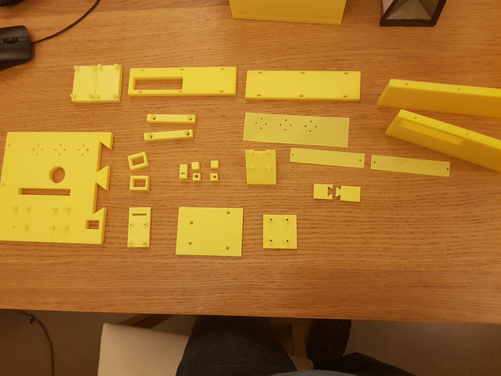  

## Printing the Base
I actually had some long put off maintenance that I had to do on my 3d printer. I put it off even longer, and kept having trouble getting prints to finish. For instance, look what I came home to one day:  
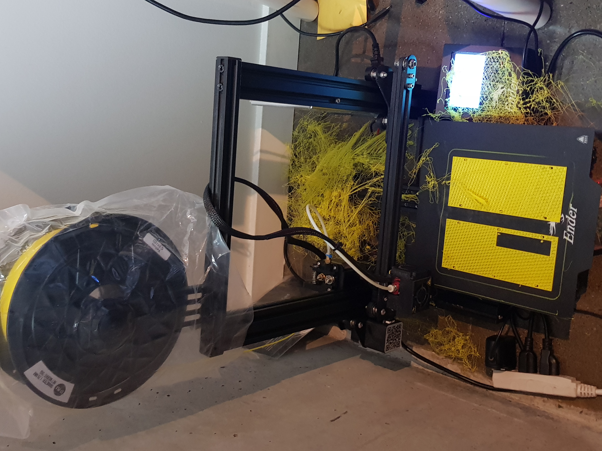  

I eventually would install OctoPrint during this faze so that I could remotely monitor and shutdown my printer. I also replaced a clogged nozzle, replaced the springs on the 3d Printer Bed with stronger ones, and many other changes. Check out how gunked the nozzle was after one of the print failures:  
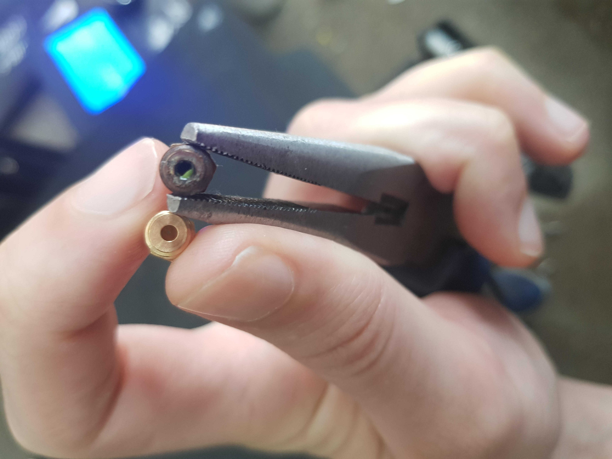  

I also cleaned out the tube that feeds plastic to the extruder. you can see there was plastic stuck in it, which meant the extruder couldn't push the new plastic through:
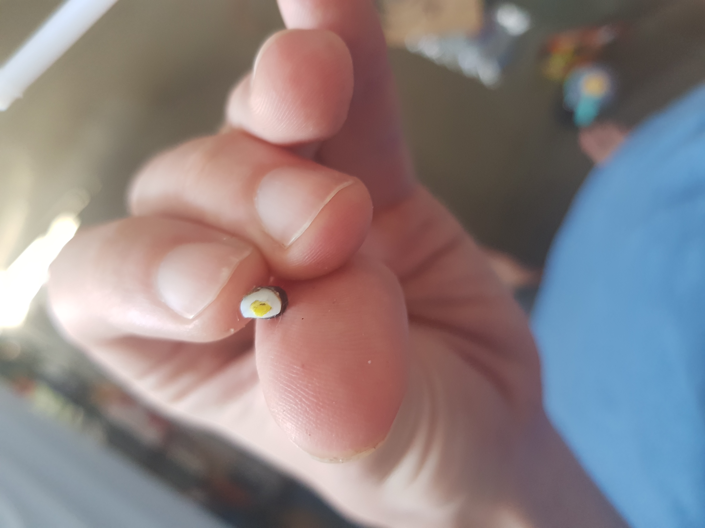  

This lead to problems where parts would be missing a layer, where the extruder got stuck and couldn't push plastic through:  
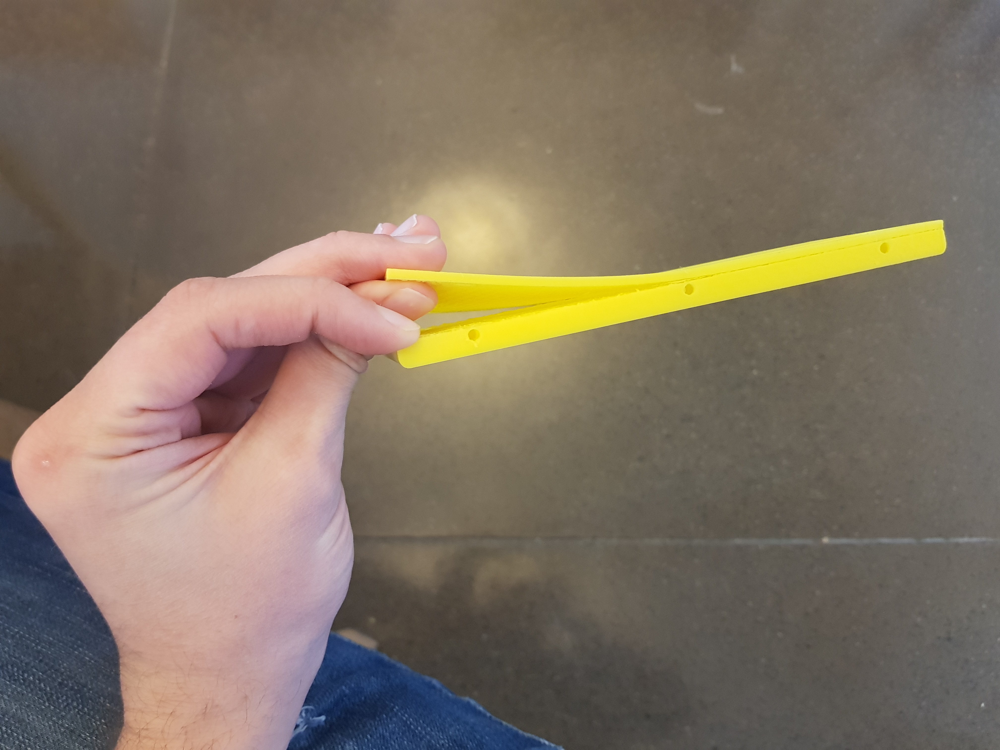  

I exited this phase having learned a lot about troubleshooting my printer, and having replaced a lot of parts to make the printer more durable and reliable in the future. Overall, a big win as I rely on this printer for many projects.  

## Assembly
Now I had my base and I started to assemble it with the electronics. You can see a sneak peek at everything and how it mounts. I still need to tidy up my wiring. In retrospect I could have designed wire channels into the base to help keep stuff tidy:  
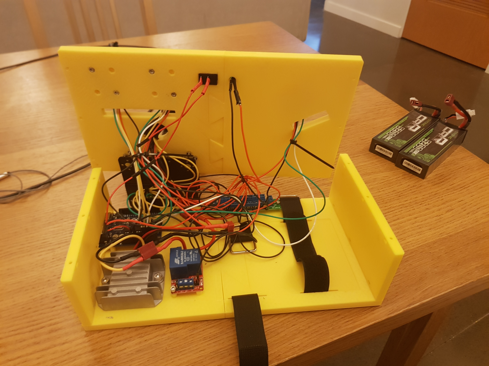  

But from the top, it looks tidy:  
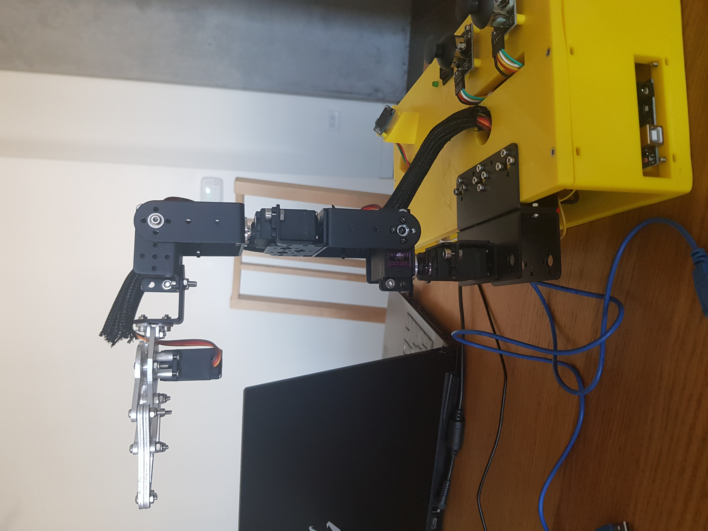  

I did have a bit of a batery fiasco here where I left two batteries connected in serial for a couple nights. This lead to them overdischarging to probably about 2.5 volts, which is pretty bad. I ended up recharging them at a very low amperage, but these batteries are no longer safe to use or to charge, so I'm monitoring them carefully and will replace them soon.  

## Complex Arduino Software with IK Model
I ended up writing an IK model for the robot arm using some videos I saw from youtube and building on them to suit my robot. [This](https://www.youtube.com/watch?v=IN8tjTk8ExI)  video from James Bruton was very helpful. That said I had to make many changes for my IK model and develop some new functionality because my robot arm had different lengths for the upper and lower arm and because I added a third degree of freedom to my IK model as I wanted to control 3 servos, not 2. I'll talk about the kinematics after the project phases. That said, this software is available in the robo_arm_arduino_inverse_kinematics folder.  

## Complex ROS Software with IK Model
I started out writing pretty elaborate code to integrate the arm with ROS. I published a message with the joystick values from the robot, then on my laptop would publish a cmd_vel and a gripper control message off of that, but then when I started subscribing to those messages from the Arduino, I quickly ran out of space on the Arduino. The code for this is in the: ros_robo_arm_joy folder, and the ros code in the src folder as joy_listener.cpp. In my experience, one subscriber was already coming up close to the memory limits for the arduino, so I wanted to keep things simple. I settled on publishing a message from my laptop that had the x, y, z, gripper target, and how long to take to move there. From there the Arduino subscribed to that message and calculated the IKs to move the servos itself. The Arduino code for this approach that I settled on is in the arduino_ros_arm folder.

# Inverse Kinematics  
The IK model for this is pretty interesting. We take the point we command (x,y,z) as the point the gripper's jaws close on. Taking two dimensions, Z, X, we can solve for the arm length, and then use that to solve for various angles because we know all three sides of the ensueing triangle: 
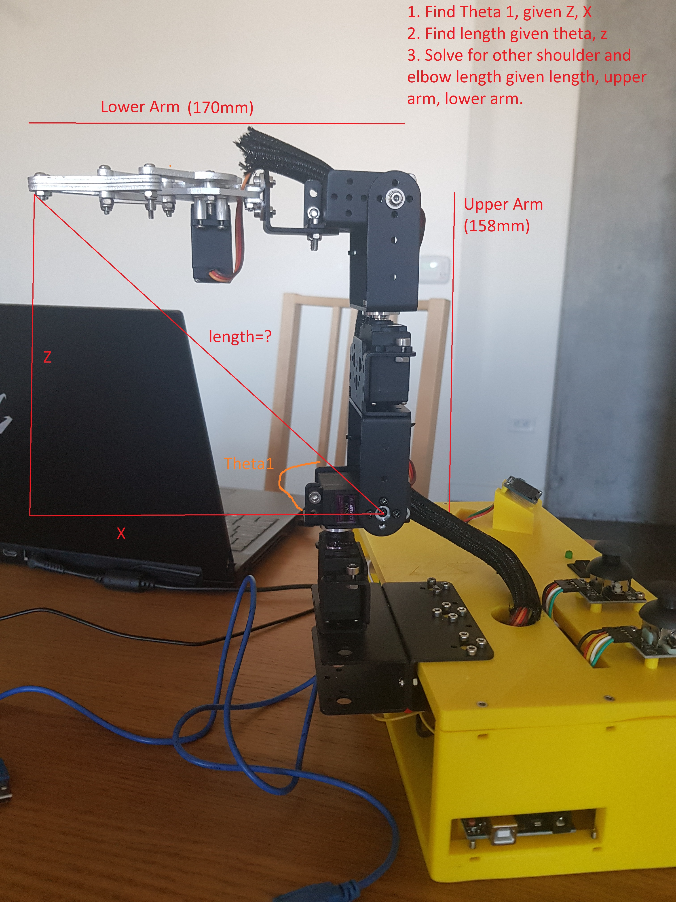  

When we add in the third servo, the base servo of the arm, things get a tad more complicated.  

Consider this picture as if you were looking down at the robot arm and the base. Given x,y coordinates of the gripper, we can solve for the base servo angle of rotation. We can also solve for the length F that I've labeled that will be important in solving the rest of the angles.    
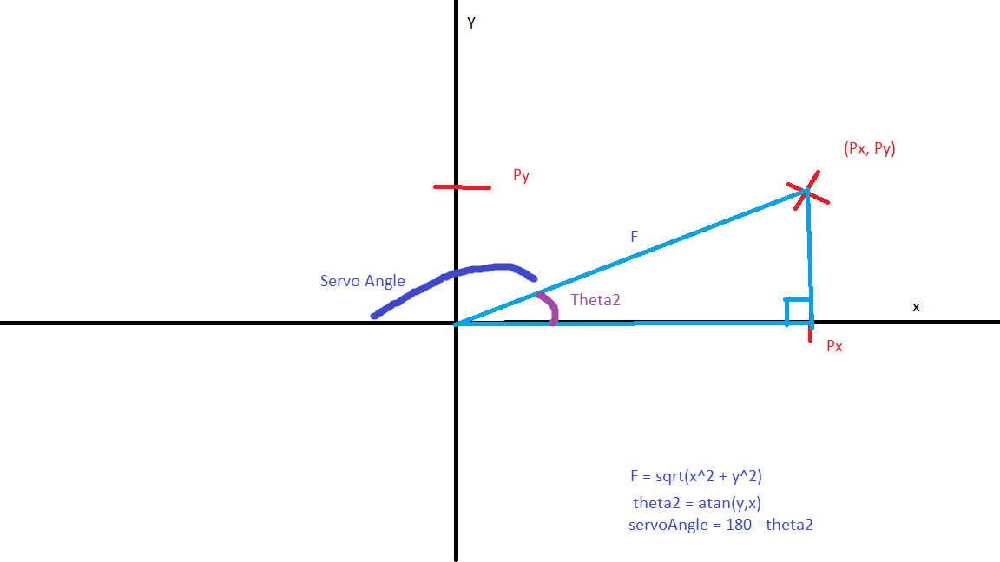  

Then in 3d space, we see F is the base of a triangle. We know the z coordinate, so can solve the third side of the triangle given its a right triangle. Now we have three sides of a triangle and we know the upper and lower arm lengths, so as per the first picture in this section we can solve the remaining two servos.
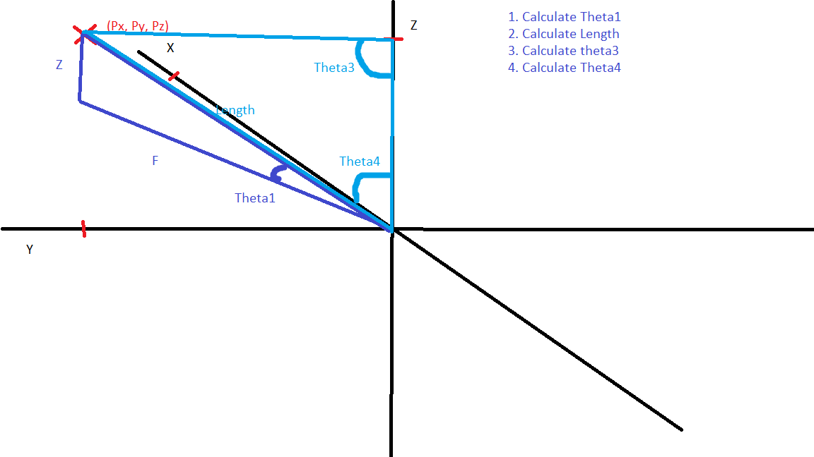  

You map everything together using offsets that come from how you've installed your servos. I didn't install mine so that when commanded to 45 degrees they made a 45 degree line with the table, so I had to have offsets for that.


# Setting It Up ROS

First, make a catkin workspace for the robo arm.
```
mkdir -p ~/robo_arm_catkin/src
cd ~/robo_arm_catkin/src
```

Then, clone the repo into the src folder of the catkin ws you created
```
git clone https://github.com/MZandtheRaspberryPi/robo_arm.git
```

Now you can make the catkin ws and then source it and run commands.
```
cd ~/robo_arm_catkin
catkin_make
source ~/robo_arm_catkin/devel/setup.bash
```

To generate the custom arduino messages, find the location of your arduino libraries folder and remove the ros_lib, and regenerate it. Make sure you've sourced the robo_arm workspace.
```
rm -rf /home/mz/Arduino/libraries/ros_lib
rosrun rosserial_arduino make_libraries.py ~/Arduino/libraries
```

Running the launch file. Note that my launch file that launches the serial node to communicate with the arm is set to ttyS0 as i'm using a VM and passing the com port to the VM. If you have your robo arm connected to a different serial port you'll need to edit the launch file and change the parameter for the serial port accordingly.
```
roslaunch robo_arm robo_arm.launch 
```

Early on, realized that having 1 publisher and 1 subscriber in an Arduino Uno was pushing memory limitations. Hence, trimmed down message with just changes in x, y, z, and gripper, and time to reach there.

message example:
```
rostopic pub /robo_arm_teleop/arm_movement robo_arm/arm_control -1 '{x: 0, y: 180, z: 158, grip: 1700, duration: 1000}'
```

# Setting It Up Arduino
The Arduino setup is more straightforward. Simply upload the code in the robo_arm_arduino_inverse_kinematics folder to the Arduino.
